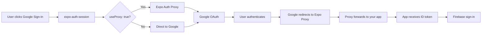

# Google OAuth Redirect URI Error - FIX REQUIRED

## Error
```
Error 400: invalid_request
Request details: redirect_uri=exp://192.168.86.133:8081
```

## Solution

The issue is that Google OAuth doesn't recognize the redirect URI. I've updated the code to use a custom scheme `conch://redirect`, but you need to **add this URI to Google Cloud Console**.

## Step 1: ✅ Code Updated

I've already updated `hooks/useGoogleAuth.ts` to use:
- Custom redirect URI: `conch://redirect`
- Proper scheme configuration
- This creates a stable redirect URI that can be whitelisted

## Step 2: ⚠️ Configure Google Cloud Console (REQUIRED)

You need to add the redirect URI to Google Cloud Console:

### Instructions:

1. **Go to [Google Cloud Console](https://console.cloud.google.com/)**

2. **Select your project** (`conch-7705c`)

3. **Navigate to**: APIs & Services > Credentials

4. **Find your OAuth 2.0 Client IDs**:
   - Web Client ID: `222266867045-mt0nmnm42cvgpcesbik6h1pge2jd3idb`
   - iOS Client ID: `222266867045-jvm744l8tcdh0075l3su9f42gm76jbpr`

5. **For the WEB Client ID**, click "Edit"

6. **Add Authorized redirect URIs**:
   ```
   conch://redirect
   https://auth.expo.io/@anonymous/Conch
   ```

7. **Click "Save"**

### Why These URIs?

- `conch://redirect` - Your custom app scheme (works in standalone builds)
- `https://auth.expo.io/@anonymous/Conch` - Expo's development auth helper

## Testing After Configuration

Once you've added the redirect URIs to Google Cloud Console:

1. **Wait 1-2 minutes** for changes to propagate

2. **Restart your Expo server**:
   ```bash
   npx expo start -c
   ```

3. **Open your app** and try "Continue with Google"

4. **It should work!** ✅

## Troubleshooting

### Still getting redirect_uri error?
- Make sure you saved the changes in Google Cloud Console
- Wait a few minutes for changes to take effect
- Verify you added both redirect URIs to the **WEB** client ID

### Can't find Google Cloud Console?
- Use this direct link: https://console.cloud.google.com/apis/credentials?project=conch-7705c

### "Failed to fetch discovery document"
- Check your internet connection
- Try restarting Expo

## Summary of Changes

1. **Restart your Expo server**:
   ```bash
   npx expo start -c
   ```

2. **Open your app** on a device or simulator

3. **Click "Continue with Google"**
   - You should see the Google account picker
   - Select your account
   - Authorize the app
   - You'll be signed in!

## For Production Builds

When you build for production (not Expo Go), you'll need to:

### Option 1: Keep Using Proxy (Easiest)
- Leave `useProxy: true` 
- Works in both development and production
- Simplest setup

### Option 2: Configure Native Redirect URIs (Advanced)
If you want to disable the proxy for production:

1. **Update the hook** to conditionally use proxy:
   ```typescript
   useProxy: __DEV__, // Only use proxy in development
   ```

2. **Add authorized redirect URIs** in Google Cloud Console:
   
   **iOS**:
   - Go to [Google Cloud Console](https://console.cloud.google.com/)
   - Select your project
   - Navigate to: APIs & Services > Credentials
   - Select your iOS OAuth client
   - Add authorized redirect URI:
     ```
     social.conch.app:/oauth2redirect/google
     ```

   **Android**:
   - Android uses SHA-1 fingerprints instead of redirect URIs
   - Add your app's SHA-1 to Firebase Console > Project Settings > Your Android App
   - Firebase automatically configures Google Cloud Console

## Current Configuration

The hook now uses:
- ✅ **`useProxy: true`** - Uses Expo's auth proxy
- ✅ **Proper scopes**: `openid`, `profile`, `email`
- ✅ **All OAuth client IDs** configured correctly

## Troubleshooting

### Still getting redirect_uri error?
1. Make sure you saved the changes to `hooks/useGoogleAuth.ts`
2. Restart Expo with cache clear: `npx expo start -c`
3. Try closing and reopening your app

### "User cancelled" or browser closes immediately?
- This is normal if you dismiss the Google account picker
- Try again and select an account

### "Failed to sign in with Google"
- Check your internet connection
- Verify Firebase Authentication has Google Sign-In enabled
- Check the console logs for specific errors

## Why This Works



## Summary

✅ **Problem**: Redirect URI not authorized  
✅ **Solution**: Use Expo's auth proxy with `useProxy: true`  
✅ **Status**: Ready to test!

Try signing in with Google now - it should work! 🎉

